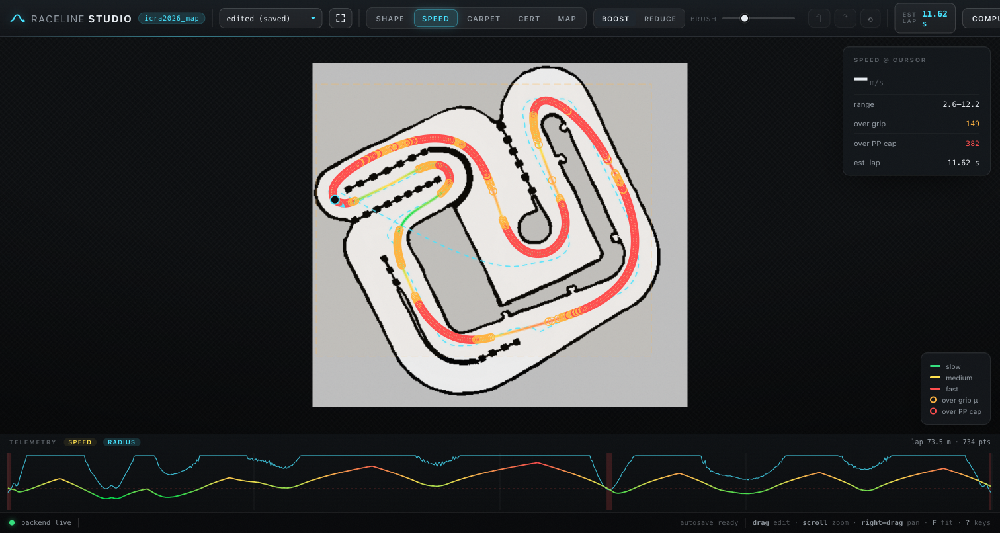

# Raceline Studio

Interactive raceline editor for F1TENTH-style autonomous racing. Shape a
raceline over a SLAM map, compute friction-circle speed profiles, extract a
live centerline while you edit the map, optimize for minimum curvature or
minimum time, and ship the result onto the car with one click.

**[Try the browser demo](https://a2ngerer.github.io/raceline-studio/)** — the
full tool running client-side via WebAssembly (Pyodide). Nothing to install,
nothing uploaded anywhere.



## Features

- **Shape editing** — drag the line with an elastic Gaussian brush, live
  curvature colouring against the car's minimum turn radius, undo/redo,
  revert-to-saved.
- **Speed profiles** — friction-circle velocity profile (forward/backward
  feasibility passes), dwell brush to boost/reduce sections, over-grip
  markers, live lap-time estimate, telemetry strip (speed + radius vs. arc
  length).
- **Live centerline** — edit the map (wall/free/grey pencil, flood fill) and
  the centerline recomputes in a cancellable background job, typically well
  under a second. A `REGION` polygon restricts where it is computed.
- **Optimization** — minimum curvature (linearised IQP against the live
  corridor) and minimum time (curvature/length blend sweep scored by lap
  time), candidates streamed as ghost lines while the job runs.
- **Vehicle parameters** — width, wheelbase, max steering angle and wall
  safety margin are editable in the settings drawer. They drive the minimum
  turn radius (R_min = wheelbase / tan(δ_max)) used by the curvature
  colouring and telemetry strip, and the optimizer keeps
  width/2 + margin off every wall. Gaps narrower than the vehicle (cone
  rows, dotted dividers) are excluded from the drivable corridor.
- **Zones** — carpet zones (locally stronger grip µ) and certainty zones
  (per-point controller hints) saved as JSON sidecars.
- **Upload to car** — saves the CSV and `scp`s it (plus sidecars, optionally
  the map) to a configurable host/folder. Strict input validation, no shell
  interpolation.
- **Crash safety** — three-layer autosave (localStorage, server session
  file, `sendBeacon` on tab close), atomic CSV writes with `.bak`, restore
  banner after a crash or accidental close.

## Quick start

One command starts the backend and opens the browser on it:

```bash
# with uv (https://docs.astral.sh/uv/)
uvx raceline-studio --map maps/icra2026_map/map.yaml

# or from a clone
uv run raceline-studio --map maps/icra2026_map/map.yaml

# or plain pip
pip install raceline-studio
raceline-studio --map maps/icra2026_map/map.yaml
```

Flags: `--line <csv>` start line, `--out <csv>` save target (default
`./racelines/<map>_raceline.csv`), `--port`, `--host`, `--open-loop`,
`--no-browser`. If the port is busy, the next free one is used.

### Docker

```bash
docker build -t raceline-studio .
docker run --rm -p 8754:8754 -v "$PWD/maps:/maps" -v "$PWD/racelines:/racelines" \
  raceline-studio --map /maps/icra2026_map/map.yaml --out /racelines/icra2026_map_raceline.csv
# open http://127.0.0.1:8754
```

## Input / output formats

- **Map**: ROS `map_server` pair — `map.yaml` (resolution, origin,
  thresholds) + greyscale image (`.png`/`.pgm`).
- **Raceline CSV**: `x_m,y_m` (geometry only), `x_m,y_m,v_mps` (with speed
  profile) or
  `x_m,y_m,v_mps,certainty,cert_lock,cert_force_reactive` (with certainty
  zones). World coordinates in metres.
- **Sidecars**: `<map>_carpet.json`, `<map>_certainty.json` next to the CSV.
- An optional `centerline.csv` next to the map (plain `x_m,y_m` or TUM
  4-column format) is used as the start line.

## Browser demo

`demo/build_demo.sh` assembles a fully static build that runs the identical
Python compute core in the browser via [Pyodide](https://pyodide.org)
(numpy/scipy/scikit-image compiled to WebAssembly). Host the output folder
anywhere — GitHub Pages, any static web space — or embed it:

```html
<iframe src="https://a2ngerer.github.io/raceline-studio/" style="width:100%;height:800px;border:0"></iframe>
```

Demo limitations: the scp upload is disabled (browsers cannot open SSH
connections) and SAVE downloads the CSV instead of writing to disk. The
first visit downloads the scientific Python stack (~60 MB, cached
afterwards).

## Architecture

```
raceline_studio/
├── core/          pure compute: map IO, centerline skeleton pipeline,
│                  IQP optimizer, velocity profile — no HTTP, no threads
├── server.py      desktop backend: HTTP + SSE, cancellable jobs,
│                  crash-safe persistence, scp upload
├── wasm_api.py    the same core wired up for Pyodide (browser demo)
└── web/           canvas frontend (vanilla ES modules + GSAP, no build step)
```

The hot paths run in compiled code (numpy / scipy / scikit-image), so the
editor stays interactive: a full centerline extraction takes ~0.05 s on a
~300×250 map, an optimizer pass well under a second.

## Development

```bash
uv sync --group dev
uv run pytest
uv run ruff check .
```

## License

[MIT](LICENSE)
